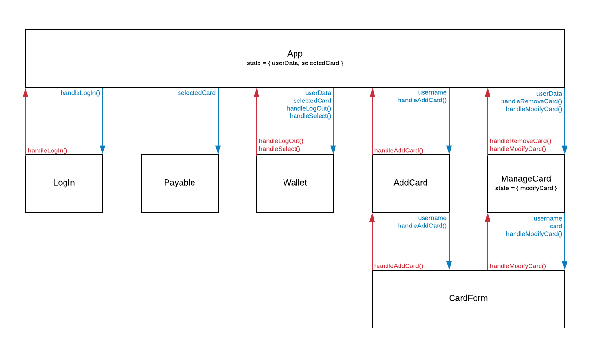

# [chowallet](https://chowallet.herokuapp.com/)

chowallet is a persistent digital wallet where users can create user accounts and create, read, update, and delete credit cards associated with their account. chowallet provides desktop and mobile support via responsive CSS styling. Front-end components are built using ReactJS and React Router to handle dynamic URLs. Back-end API is built on NodeJS using ExpressJS as the server-side framework and MongoDB/Mongoose for data persistence. A rudimentary session management is implemented using Express Session. chowallet is deployed on Heroku and can be found [here](https://chowallet.herokuapp.com).

## Table of Contents
1. [Requirements](#requirements)
1. [Technologies](#technologies)
1. [Development and Installation](#development-and-installation)
1. [React Component Hierarchy](#react-component-hierarchy)
1. [API Design](#api-design)
    1. [Routes](#routes)
    1. [Middlewares and Error Handling](#middlewares-and-error-handling)
    1. [NoSQL Database](#nosql-database)

### Requirements

- Node
- npm

### Technologies

- ReactJS, React Router
- CSS
- Webpack, Babel
- ExpressJS, Express Session
- MongoDB, Mongoose

### Development and Installation

To install all dependencies:

```
npm install
```

For client-side development:

```
npm run react-dev
```

For server-side development:

```
npm run server-dev
```

In addition, the following environmental variables need to be configured to run the server-side development:

```
PORT=[YOUR_PORT_NUMBER or defaults to 3000]
MONGODB_URI=[YOUR_MONGODB_URI]
```

### React Component Hierarchy

React Component Hierarchy is illustrated in the diagram below:



### API Design

#### Routes

The API handles the following route requests:

| Method | URL | Request Body | Response Body |
| -------------|-------------|-----|---|
| POST | `/login` | `username` | `{ userData }` containing all cards associated with user |
| GET | `/logout` | none | none |
| GET | `/userData` | none (session data stored in cookie used to validate userId) | `{ userData }` containing all cards associated with user |
| POST | `/users/:username/cards` | `{ card }` (session data stored in cookie used to validate userId) | updated `{ userData }` |
| PUT | `/users/:username/cards/:id` | `{ card }` (session data stored in cookie used to validate userId) | updated `{ userData }` |
| DELETE | `/users/:username/cards/:id` | none (session data stored in cookie used to validate userId) | updated `{ userData }` |

#### Middlewares and Error Handling

Middlewares are used to perform the following services:

- express.static to serve static assets
- body-parser module to parse urlencoded and json req.body
- morgan module to log all HTTP requests
- express-session to manage sessions, but no authentication support (ie. if a user does not exist in the database, create one)
- error handler to catch all errors passed down via next() argument call

#### NoSQL Database

The following illustrates a typical user data stored in MongoDB:

```javascript
{
    "_id": {
        "$oid": "5a5f1c61c5f637408ad00861"
    },
    "username": "Clara",
    "cards": [
        {
            "name": "X-5555",
            "_id": {
                "$oid": "5a5fb2d78c30f24553e19d5d"
            },
            "cvv": 1212,
            "expiration": 1212,
            "type": "Discover",
            "number": 121233344445555,
            "lastName": "Cat",
            "firstName": "Hello"
        },
        {
            "name": "X-7788",
            "cvv": 2222,
            "expiration": 2222,
            "type": "Amex",
            "number": 1212444455667788,
            "lastName": "Foo",
            "firstName": "Bar",
            "_id": {
                "$oid": "5a5fe2db7458cc49428e9534"
            }
        },
    ],
    "__v": 0
}
```
